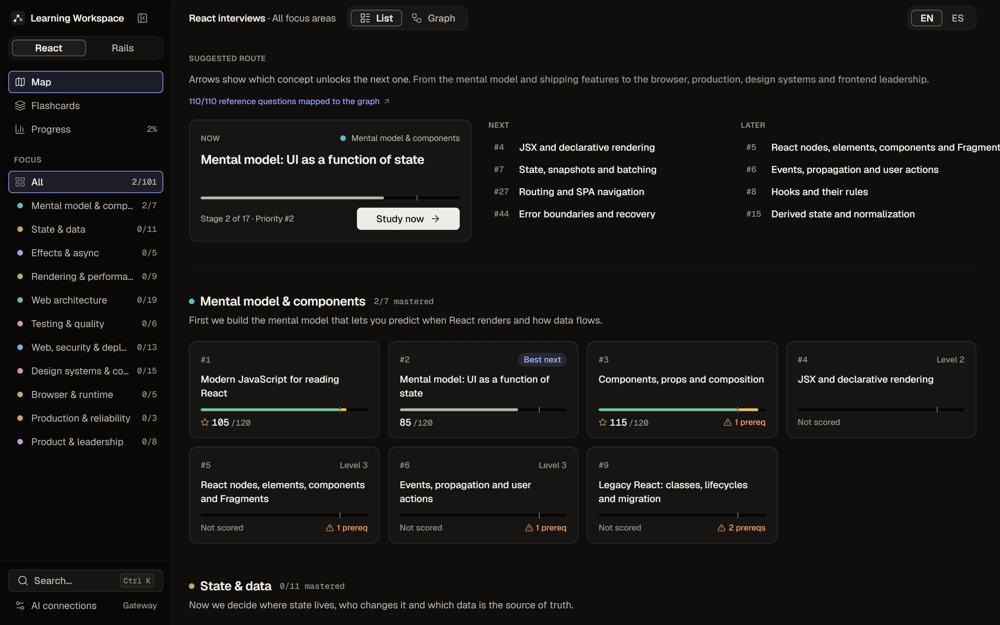
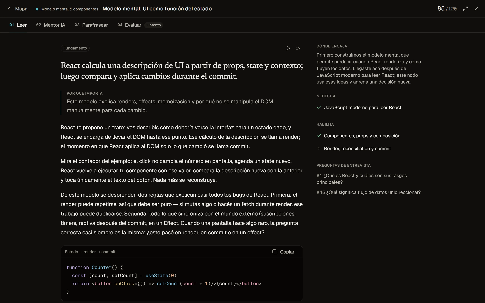
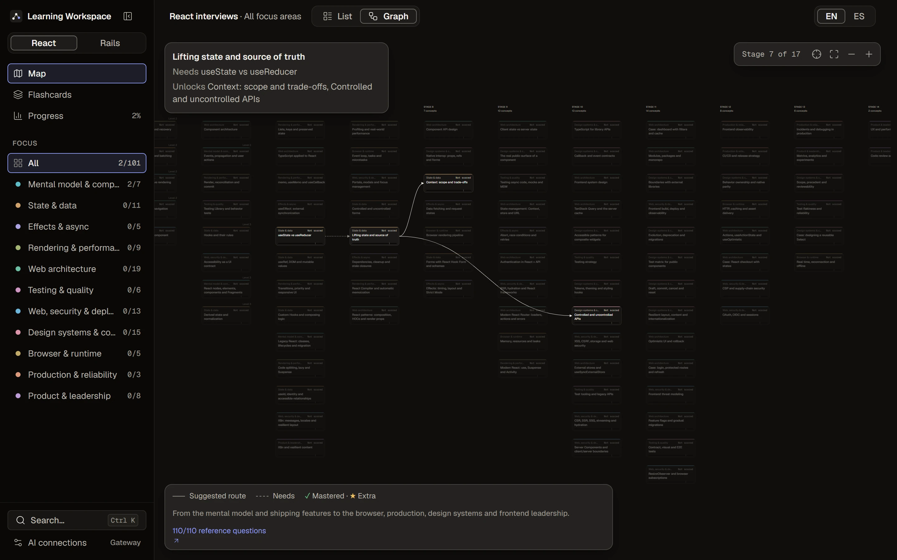
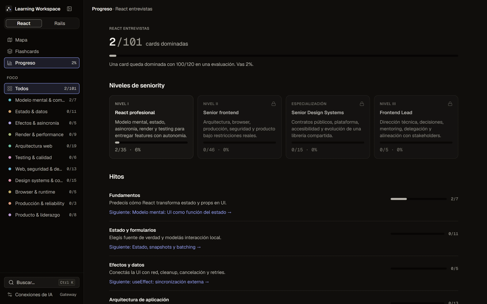

# KnowGraph

A study workspace for senior React and Rails interviews: 142 concepts in a dependency graph, each studied in a four-stage session with an AI mentor that grades your explanation.

**[Live app](https://know-graph.vercel.app)** · [Case study](https://anderssonfelix.com/work/knowgraph/) · Author: [Felix Andersson](https://anderssonfelix.com)



## What it is

I built KnowGraph to prepare for my own senior interviews. The curriculum is two graphs: React (101 concepts, 212 prerequisite links, 11 focus areas, 16 milestones, 4 seniority levels) and Rails (41 concepts, 54 links). A link means one concept gives you the mental model for the next; it suggests an order but never blocks you from studying something out of sequence. The interface is in Spanish and still uses the project's working title, Learning Workspace.

Every concept opens a four-stage session: **Read** the card (explanation, naive vs. senior code, pitfalls, sources, optional read-aloud), talk it through with a Socratic **Mentor**, **Paraphrase** it from memory with dictation and a live coach, then **Evaluate**: an LLM grades the explanation against a four-part rubric (accuracy, causality and trade-offs, application, completeness). Scores run from 0 to 120. Up to 100 measures coverage of the essential material; 101-120 is a separate excellence tier that only opens after full coverage, to push back on the grade inflation LLMs tend toward ([ADR 0006](docs/adr/0006-dual-tier-evaluation-scale-0-120.md)). Everything is local-first and bring-your-own-key.

<table>
  <tr>
    <td width="50%" valign="top">
      
      <br><sub>Study session, Read stage. Tabs for the other three stages sit above the text.</sub>
    </td>
    <td width="50%" valign="top">
      
      <br><sub>Dependency graph. Hovering a concept brings its prerequisites and dependents forward.</sub>
    </td>
  </tr>
  <tr>
    <td colspan="2" align="center">
      
      <br><sub>Progress by seniority level and milestone.</sub>
    </td>
  </tr>
</table>

## How it's built

- **Headless core, React as the view.** `src/logic/learningController.js` is a framework-free store that React reads through `useSyncExternalStore` (`src/hooks/useController.js`). It replaced a single 2,642-line `App.jsx` (kept in `legacy/`), and its logic is tested in plain Node under `tests/logic/`. Files in the presentation layer (`src/ui/`) stay under 150 lines each. See [ADR 0005](docs/adr/0005-headless-state-machine-use-sync-external-store.md) and [ADR 0008](docs/adr/0008-strict-150-line-file-limit-and-ci-linter.md).
- **Rendering JSON while it streams.** The evaluation is structured JSON streamed over SSE. On the gateway, `server/ai/partialJson.js` and `server/ai/streamBlocks.js` scan the incomplete JSON and emit finished fields and growing text leaves as separate events, so rubric bars and feedback fill in while the model is still writing. The score comes from a small request without reasoning, sent before the longer feedback request (`server/ai/evaluator.js`), and Zod validates every final object (`server/ai/schemas.js`). The browser reads the stream with `fetch` and a `ReadableStream` reader in `src/ai/client.js`.
- **Bring-your-own-key gateway.** One Node handler (`server/index.js`) runs as a local process, as a Vercel function (`api/ai/[...slug].js`) or as a child process of the Electron app. The user's provider profile travels with each request, is validated with Zod and is never written to disk or logged. In production the gateway only accepts HTTPS endpoints that resolve to public IPs (`server/ai/providers.js`). Any OpenAI-compatible Chat Completions endpoint works; the presets live in `shared/providerCatalog.js`. See ADRs [0001](docs/adr/0001-llm-provider-registry.md) to [0004](docs/adr/0004-user-owned-local-harness-and-desktop-electron.md).
- **Local-first storage.** Attempts, drafts and live reviews are stored in IndexedDB through `idb` (`src/ai/learningStore.js`); preferences and provider connections sit in `localStorage`. There is no account and no remote database. A JSON backup exports and restores all of it, saved provider keys included (`src/ai/backup.js`).
- **Work that outlives the screen.** `src/ai/backgroundTaskManager.js` keeps evaluations running after you leave the card, reports them in a global HUD with open and cancel actions (`src/ui/hud/TaskHud.jsx`), and syncs them across tabs with `BroadcastChannel`.
- **Graph layout without D3.** `src/logic/topologicalLayout.js` ranks concepts with Kahn's algorithm (tolerating cycles), then runs eight barycenter sweeps to reduce edge crossings. The result is plain SVG with pan and zoom (`src/ui/graph/`).

## Stack

React 19 and Vite 6 in plain JavaScript (no TypeScript) · hand-written CSS on design tokens (`src/ui/theme/tokens.css`) · Geist and Newsreader · Mermaid (lazy-loaded) and Prism for diagrams and code · Node gateway with Zod and server-sent events · IndexedDB via `idb` · Web Speech API for read-aloud and dictation · Playwright · Electron for the optional desktop build · Vercel for hosting.

## Getting started

Requires Node.js 20+ and npm.

```bash
npm install
npm run dev        # http://localhost:5173, proxies /api/ai to the gateway
```

The map, cards, graph and progress views work without the gateway. The Mentor, Paraphrase and Evaluate stages need it:

```bash
cd server
npm install
cp .env.example .env
npm start          # http://127.0.0.1:4317
```

No API key is required to start the gateway. Open **Conexiones de IA** in the app and add a provider (OpenAI, OpenRouter, Groq, MiniMax, Ollama, LM Studio or any OpenAI-compatible endpoint); the key is kept in your browser and sent with each request. Optional variables in `server/.env`:

| Variable | Purpose |
| --- | --- |
| `MINIMAX_API_KEY`, `MINIMAX_MODEL` | Default provider for requests that carry no profile of their own. |
| `FREELLMAPI_BASE_URL`, `FREELLMAPI_API_KEY` | Fallback for the default provider. Never used for a request that brings its own key. |
| `CORS_ALLOWED_ORIGINS` | Comma-separated origins allowed to call the gateway. |
| `ALLOW_PRIVATE_PROVIDER_URLS` | Allows local or LAN endpoints. On by default outside production. |

For a deployed frontend, `VITE_AI_API_URL` (root `.env.example`) points at a gateway on another origin. Leave it empty when the gateway shares the origin, as it does in development and on Vercel.

### Checks and builds

| Command | What it does |
| --- | --- |
| `npm run test:logic` | Headless tests for the controller, layout, provider settings, background tasks and more. |
| `npm run build && npm run test:e2e` | 33 Playwright tests across 6 specs, run against the built app with the gateway. |
| `npm run check` | Content audit of the React graph (`npm run audit:react`) plus a production build. |
| `npm run desktop:dev` | Opens the app in Electron, starting the gateway if it isn't running. |
| `npm run desktop:dist` | Builds the Windows installer. |

## Project structure

```text
src/
  logic/        headless controller, selectors, graph registry, topological layout
  ai/           SSE client, background tasks, BYOK settings, IndexedDB store, backup
  ui/           presentation layer: shell, map, graph, study stages, flashcards, progress
  react*.js     React curriculum, composed from content layers
  lessons.js    Rails lesson content (graph in src/logic/railsGraph.js)
server/         AI gateway: routes, provider registry, prompts, Zod schemas, stream parsers
api/ai/         Vercel function that mounts the same gateway
shared/         provider catalog used by both the UI and the gateway
electron/       desktop shell
tests/          logic suites, Playwright specs and state fixtures
specs/          product and design specs for each UI iteration
docs/           guides and architecture decision records
```

To add a React concept, start in `src/reactGraph.js`, with sources in `src/reactSources.js` and interview questions in `src/reactInterviewQuestions.js`; `npm run check` fails if a node is missing its explanation, code sample, steps, failure modes, HTTPS sources or valid prerequisites. Rails content lives in `src/lessons.js` and is registered in `src/logic/railsGraph.js`.

## Documentation

- [Architecture decision records](docs/adr/README.md): 10 ADRs on the provider registry, BYOK, the headless store, the 0 to 120 scale, the rubric and the working process.
- [PRODUCT.md](PRODUCT.md) and [DESIGN.md](DESIGN.md): product intent and the v3 design system.
- [Workspace UI v3 spec](specs/002-workspace-ui-v3/spec.md) and [AGENTS.md](AGENTS.md): the spec-driven workflow the UI was built under.
- [LLM learning experience plan](docs/LLM_LEARNING_EXPERIENCE_PLAN.md) and [headless API handoff guide](docs/PRESENTATION_HANDOFF_GUIDE.md).
- [Deploying to Vercel with BYOK](docs/DEPLOY_VERCEL.md) and [the desktop app](docs/DESKTOP_APP.md).

Progress lives in your browser, so clearing site data resets it unless you exported a backup.
