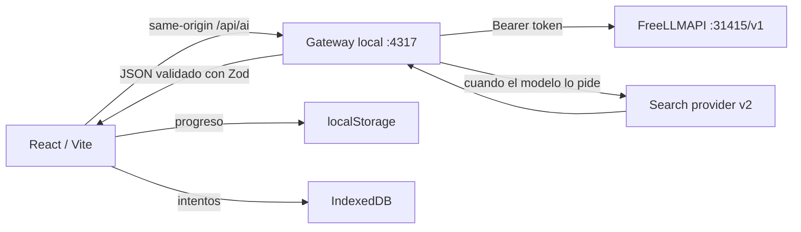

# LLM integration plan: paraphrase, tutoring, and flashcards

> Status: design plan + v1 implementation log.
>
> Date: 2026-08-06.

## 1. Goal

Replace the multiple-choice quiz with a lower-friction active recall experience:

1. The user studies a card.
2. They write in their own words what they understood.
3. An LLM evaluates accuracy, reasoning, examples, and trade-offs against the card's content.
4. The UI shows an explainable score, strengths, gaps, misconceptions, and a concrete prompt to retry.
5. Every attempt is stored locally and can be reviewed later.
6. A flashcards view makes it possible to review the latest evaluated paraphrase of each node.
7. (v2) The user can ask questions about a card with web search and verifiable citations.

The LLM acts as a tutor and quality mirror. It does **not** block marking a node as understood.

## 2. Endpoint

```text
http://127.0.0.1:31415/v1
```

It is a local instance of [FreeLLMAPI](https://github.com/tashfeenahmed/freellmapi) (OpenAI-compatible proxy). The user provides their unified token in `server/.env` (see §3).

## 3. Architecture: mandatory local gateway

**The browser must not call `127.0.0.1:31415` directly.** Reasons:

- `VITE_FREELLMAPI_API_KEY` would bundle the key into the JS bundle.
- FreeLLMAPI does not guarantee `Access-Control-Allow-Origin`.
- You want prompts, schemas, timeouts, parsing, the tool loop, and errors centralized.

**MVP tradeoff (v1):** the gateway receives the card content from the browser in the body of `/api/ai/evaluate`. This is acceptable for local single-user use; the "clean" boundary —the gateway resolves the node by id from a shared source, with no editorial content sent by the browser— is left as a future improvement. The body is size-limited (200 KB total, `answer` capped at 4000 chars) and fields are filtered in `buildEvaluationUserPayload` before being sent to the model.



### File structure

```
server/
  index.js                    # HTTP local en 127.0.0.1:4317
  config.js                   # lee .env, valida
  ai/
    llmClient.js              # fetch OpenAI-compatible con abort+timeout
    parse.js                  # estrategia 3 niveles: schema → json_object → repair
    schemas.js                # Zod + JSON Schema (separados, sincronizados)
    evaluator.js              # evalúa un paraphrase
    prompts.js                # system prompts versionados
    errors.js                 # errores tipados → HTTP
  .env.example
  .gitignore
  package.json

src/ai/
  client.js                   # fetch /api/ai con AbortController
  learningStore.js            # idb: attempts, drafts
  contentHash.js              # hash estable del contenido de la card
  types.js                    # tipos compartidos

src/components/
  RubricBars.jsx
  EvaluationFeedback.jsx
  ParaphraseReview.jsx
  AttemptHistory.jsx
  FlashcardView.jsx
  ViewModeToggle.jsx
```

## 4. Secure configuration

`server/.env` (gitignored, **never** `VITE_*`):

```dotenv
FREELLMAPI_BASE_URL=http://127.0.0.1:31415/v1
FREELLMAPI_API_KEY=freellmapi-...
LLM_EVALUATION_MODEL=auto:reliable
LLM_TUTOR_MODEL=auto:reliable
LLM_LIVE_MODEL=auto:fastest
GATEWAY_PORT=4317
GATEWAY_HOST=127.0.0.1
```

`server/.env.example` with placeholders only, committed.

### ngrok

If the app is exposed through a tunnel, the gateway becomes publicly reachable. Options:

- v1: the gateway **listens on 127.0.0.1 only**, so ngrok does not see it (neither does the Vite proxy).
- v2: if AI is needed through ngrok, a simple passcode or feature flag.

## 5. Persistence

- **Progress** (set of understood IDs, filters, view): `localStorage` (already existing).
- **Attempts and drafts**: IndexedDB via `idb`.

### IndexedDB schema (v1)

```js
// attempts
{
  id: "attempt_<uuid>",
  graphId: "react" | "rails" | string,
  nodeId: string,
  createdAt: string,          // ISO
  answer: string,             // paraphrase del usuario
  contentHash: string,        // hash estable del contenido de la card
  evaluatorVersion: "v1",
  model: string,              // "auto:reliable"
  evaluation: {
    score: number,            // 0..100, COMPUTADO en el gateway
    status: "strong" | "developing" | "review",
    rubric: {
      accuracy: { score, max: 40, note },
      causalityAndTradeoffs: { score, max: 25, note },
      application: { score, max: 20, note },
      completeness: { score, max: 15, note },
    },
    strengths: string[],
    gaps: { topic, severity, explanation, revisionHint }[],
    misconceptions: { quote?, correction }[],
    nextAttemptPrompt: string,
    conciseVerdict: string,
  },
  repairAttempts: number,
}

// drafts
{
  key: "graphId:nodeId",
  text: string,
  updatedAt: string,
}
```

**Policy**: 12 attempts per node, FIFO. The draft is independent of the latest attempt. If the card content changes, previous attempts show "evaluado con versión anterior".

## 6. Endpoint `/api/ai/evaluate`

### Request

```http
POST /api/ai/evaluate
Content-Type: application/json

{
  "graphId": "react",
  "nodeId": "state_updates",
  "answer": "React calcula cada render...",
  "contentHash": "sha256:..."
}
```

### Response

```json
{
  "attempt": {
    "id": "attempt_...",
    "createdAt": "2026-08-06T20:00:00.000Z",
    "model": "auto:reliable",
    "routedVia": "provider/model",
    "contentHash": "sha256:...",
    "evaluatorVersion": "v1",
    "evaluation": {
      "score": 82,
      "status": "strong",
      "rubric": {
        "accuracy": { "score": 34, "max": 40, "note": "..." },
        "causalityAndTradeoffs": { "score": 20, "max": 25, "note": "..." },
        "application": { "score": 16, "max": 20, "note": "..." },
        "completeness": { "score": 12, "max": 15, "note": "..." }
      },
      "strengths": ["..."],
      "gaps": [],
      "misconceptions": [],
      "nextAttemptPrompt": "...",
      "conciseVerdict": "..."
    }
  }
}
```

## 7. LLM design: the critical parts

### 7.1 JSON Schema separate from Zod

**Rule**: `schema._def` is internal Zod API. Do not use it for `response_format`.

- `EvaluationZod` (Zod): to validate at runtime what the model returned.
- `EvaluationJsonSchema` (hand-written plain object): for `response_format: { type: "json_schema", json_schema: { schema: EvaluationJsonSchema, strict: true } }`.
- Test: `expect(toJsonSchema(EvaluationZod)).toEqual(EvaluationJsonSchema)` (or a manual sync check with a comment).

### 7.2 Server-side recomputed score

The **model does not send** the total `score`. Only the 4 dimensions. The gateway sums:

```js
function computeTotal(rubric) {
  const sum = rubric.accuracy.score + rubric.causalityAndTradeoffs.score
            + rubric.application.score + rubric.completeness.score;
  return Math.max(0, Math.min(100, Math.round(sum)));
}
```

If the model "makes up" a 95 in the JSON, it is ignored. The UI shows the sum, not what the model said.

### 7.3 Three-level parsing strategy

```text
1) response_format: json_schema
   El provider fuerza JSON válido. parsear y validar con Zod.
   ↓ falla
2) JSON.parse(text) directo
   Si el provider devolvió JSON pero sin schema enforcement, parsear manualmente.
   ↓ falla
3) Repair prompt
   Mandar el texto crudo al modelo con el schema en system, pedir "respondé SOLO el JSON correcto".
   ↓ falla
   error tipado SchemaMismatchError, la UI muestra error y conserva el borrador.
```

We do not use `looksLikeJson` with `{` heuristics because the model can wrap the JSON in prose. **Any parse failure triggers repair** (codex fix #2).

### 7.4 Tool rounds vs final round (v2)

In the tutor with search, the last call forces `response_format: json_schema` and omits `tools`. Earlier rounds allow `tool_calls` without `response_format`. Both restrictions are never mixed in the same request (codex fix #3).

### 7.5 Verifiable citations (v2)

The gateway keeps the original `searchResults`. Each citation references a `sourceIndex`. The UI shows:

- **Sources consulted** (list with title, URL, and snippet).
- **Citations used** (each with which claim it supports and which source it points to).

Even if the model invents that a URL supports X, the `sourceIndex` points to a real snippet the user can open.

## 8. UI: feedback and navigation

### 8.1 `EvaluationFeedback`

```text
┌ Revisión de tu explicación ─────────────────────────────┐
│ 82 / 100  ·  Base sólida               Intento 3 de 5  │
│ [████████░░] Precisión 34/40                            │
│ [████████░░] Por qué y trade-offs 20/25                 │
│ [████████░░] Aplicación 16/20                           │
│ [████████░░] Cobertura 12/15                            │
│                                                          │
│ Lo que estuvo bien                                       │
│ • ...                                                    │
│                                                          │
│ Para mejorar                                             │
│ • [alto] ...                                             │
│                                                          │
│ Correcciones                                             │
│ • "..." → en realidad ...                               │
│                                                          │
│ Próximo intento                                          │
│ "Explicá también qué ocurre cuando ..."                 │
│                                                          │
│ [← Anterior] [Volver al borrador] [Siguiente →]         │
└──────────────────────────────────────────────────────────┘
```

`RubricBars` uses the native `<progress>` with `aria-label`, not ad-hoc div bars.

### 8.2 Cancellation

`AbortController` propagated end-to-end: `ParaphraseReview` → `aiClient.js` → `fetch` → `llmClient.js`. Cancelling in the UI aborts the HTTP request and the LLM call. A requestId makes it possible to correlate logs.

### 8.3 Tutor markdown (v2)

`react-markdown` + `remark-gfm` + `rehype-sanitize` (with `defaultSchema`). Blocks `<script>`, `onclick`, `<iframe>`, javascript: URIs.

## 9. Flashcards view

Toggle `[ Grafo | Flashcards ]` on the main surface.

**Front face**: category, priority, concept name, state (no answer / with draft / evaluated), score if any.

**Back face**: latest evaluated paraphrase, score badge, date, "Ver feedback", "Abrir card completa" (same modal as from the graph), "Reescribir respuesta".

**Filters**: unevaluated, score < 80, random, by category. Same graph and categories as the graph view.

## 10. Tutor with search (v2)

Endpoint `POST /api/ai/ask`. Request: `{ graphId, nodeId, question, history, useSearch }`. Response: `{ answerMarkdown, shortAnswer, usedSearch, citations, searchResults, followUps, uncertaintyNote }`.

Tool loop: 2 rounds max, 5 results max, query 3-200 chars, timeout 45s, rate limit 6 questions/min.

Each citation: `{ label, url, supports, sourceIndex }`. The gateway filters `citations` against `searchResults` by `sourceIndex` before returning to the browser.

## 11. Error handling

```js
// server/ai/errors.js
NOT_CONFIGURED, UNAUTHORIZED, RATE_LIMIT, TIMEOUT, SCHEMA_MISMATCH,
TOOL_NOT_ALLOWED, TOOL_ROUND_LIMIT, SEARCH_PROVIDER_ERROR, UPSTREAM, ABORTED
```

Each has a user-facing Spanish message and an HTTP status:

| Code | Status | UI message |
| --- | ---: | --- |
| `not_configured` | 503 | La IA no está configurada. Podés escribir igual. |
| `unauthorized` | 401 | El gateway no tiene token válido. |
| `rate_limit` | 429 | Tope alcanzado. Esperá unos segundos. |
| `timeout` | 504 | La revisión tardó demasiado. Reintentá. |
| `schema_mismatch` | 502 | No pudimos interpretar la respuesta. Reintentá. |
| `upstream` | 502 | El modelo falló. Reintentá. |
| `aborted` | — | Cancelado. |

**Never** invent a score on the client. **Never** lose the draft due to an error.

## 12. Phases

### v1 (this implementation)

- [x] Consolidated doc
- [ ] Local gateway with `GET /api/ai/status` and `POST /api/ai/evaluate`
- [ ] Zod schemas + JSON Schema separate and synchronized
- [ ] LLM client with abort+timeout
- [ ] 3-level parse strategy
- [ ] Server-side recomputed score
- [ ] Typed errors
- [ ] React client: `client.js`, `learningStore.js`, `contentHash.js`
- [ ] `ParaphraseReview` with textarea, draft, submit, cancel
- [ ] `EvaluationFeedback` with `RubricBars` and sections
- [ ] `AttemptHistory` with previous/next navigation and return to draft
- [ ] `FlashcardView` with a clean front face and a back face with the latest score
- [ ] `ViewModeToggle` Grafo/Flashcards
- [ ] Replace the multiple-choice quiz with `ParaphraseReview` in `App.jsx`
- [ ] Vite proxy `/api/ai` → gateway
- [ ] Styles for the new components
- [ ] README with gateway instructions

### v2 (later)

- [ ] `tutor.js` with tool loop
- [ ] Search provider (Brave or SearXNG)
- [ ] `NodeTutor` panel inside the card
- [ ] Per-node conversations in IndexedDB
- [ ] Evaluation cache
- [ ] Optional local metrics
- [ ] Contract tests for schemas

## 13. Decisions made

- **Model**: start with `auto:reliable` to prioritize consistent responses. Try other models later with real prompts.
- **Search**: out of v1.
- **Persistence**: IndexedDB via `idb`.
- **Frontend**: vanilla `idb` (no Dexie) to keep dependencies small.
- **Markdown**: `react-markdown` + `rehype-sanitize` (v2).
- **Non-blocking**: LLM feedback never blocks "marcar como entendido".

## 14. Out of scope (all versions)

- User accounts or cross-device sync.
- Remote database.
- Automatic graph editing based on feedback.
- Agent "autonomous navigation" or tools beyond controlled web search.
- Streaming in v1 (optional for v2).

## 15. Decisions requiring confirmation

1. **Token**: rotate the current token (it was exposed in chat) and configure the new one in `server/.env`.
2. **Model**: accept `auto:reliable` and review later.
3. **Search provider** (v2): Brave vs SearXNG.
4. **ngrok**: gateway on 127.0.0.1 only covers the most common case.
