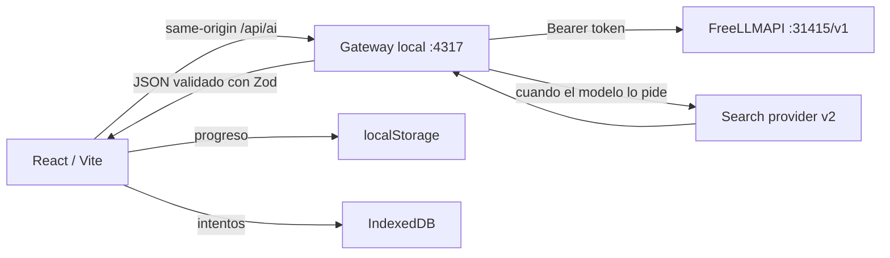

# Plan de integración LLM: parafraseo, tutoría y flashcards

> Estado: plan de diseño + bitácora de implementación de v1.
>
> Fecha: 2026-08-06.

## 1. Objetivo

Reemplazar el quiz de opciones múltiples por una experiencia de recuperación activa con menos fricción:

1. El usuario estudia una card.
2. Escribe con sus propias palabras qué entendió.
3. Un LLM evalúa precisión, razonamiento, ejemplos y trade-offs contra el contenido de la card.
4. La UI muestra un puntaje explicable, fortalezas, vacíos, errores conceptuales y una consigna concreta para reintentar.
5. Cada intento queda guardado localmente y puede revisarse después.
6. Una vista de flashcards permite repasar el último parafraseo evaluado de cada nodo.
7. (v2) El usuario puede preguntar dudas sobre una card con búsqueda web y citas verificables.

El LLM sirve como tutor y espejo de calidad. **No** bloquea marcar un nodo como entendido.

## 2. Endpoint

```text
http://127.0.0.1:31415/v1
```

Es una instancia local de [FreeLLMAPI](https://github.com/tashfeenahmed/freellmapi) (proxy OpenAI-compatible). El usuario aporta su token unificado en `server/.env` (ver §3).

## 3. Arquitectura: gateway local obligatorio

**El browser no debe llamar directo a `127.0.0.1:31415`.** Razones:

- `VITE_FREELLMAPI_API_KEY` empaquetaría la key en el bundle JS.
- FreeLLMAPI no garantiza `Access-Control-Allow-Origin`.
- Querés centralizar prompts, schemas, timeouts, parseo, tool loop y errores.

**MVP tradeoff (v1):** el gateway recibe el contenido de la card desde el navegador en el body de `/api/ai/evaluate`. Es aceptable para uso local single-user; la frontera "limpia" —el gateway resuelve el nodo por id desde una fuente compartida, sin que el browser envíe contenido editorial— queda como mejora futura. El body tiene tamaño limitado (200 KB total, `answer` cap 4000 chars) y los campos se filtran en `buildEvaluationUserPayload` antes de mandarse al modelo.



### Estructura de archivos

```
server/
  index.js                    # HTTP local en 127.0.0.1:4317
  config.js                   # lee .env, valida
  ai/
    llmClient.js              # fetch OpenAI-compatible con abort+timeout
    parse.js                  # estrategia 3 niveles: schema → json_object → repair
    schemas.js                # Zod + JSON Schema (separados, sincronizados)
    evaluator.js              # evalúa un paraphrase
    prompts.js                # system prompts versionados
    errors.js                 # errores tipados → HTTP
  .env.example
  .gitignore
  package.json

src/ai/
  client.js                   # fetch /api/ai con AbortController
  learningStore.js            # idb: attempts, drafts
  contentHash.js              # hash estable del contenido de la card
  types.js                    # tipos compartidos

src/components/
  RubricBars.jsx
  EvaluationFeedback.jsx
  ParaphraseReview.jsx
  AttemptHistory.jsx
  FlashcardView.jsx
  ViewModeToggle.jsx
```

## 4. Configuración segura

`server/.env` (gitignored, **nunca** `VITE_*`):

```dotenv
FREELLMAPI_BASE_URL=http://127.0.0.1:31415/v1
FREELLMAPI_API_KEY=freellmapi-...
LLM_EVALUATION_MODEL=auto:smart
LLM_TUTOR_MODEL=auto:smart
GATEWAY_PORT=4317
GATEWAY_HOST=127.0.0.1
```

`server/.env.example` solo con placeholders, commiteado.

### ngrok

Si la app se expone por túnel, el gateway queda accesible públicamente. Opciones:

- v1: el gateway **solo escucha en 127.0.0.1**, así ngrok no lo ve (Vite proxy tampoco).
- v2: si hace falta IA desde ngrok, passcode simple o feature flag.

## 5. Persistencia

- **Progreso** (set de IDs entendidos, filtros, vista): `localStorage` (ya existente).
- **Intentos y borradores**: IndexedDB via `idb`.

### Schema IndexedDB (v1)

```js
// attempts
{
  id: "attempt_<uuid>",
  graphId: "react" | "rails" | string,
  nodeId: string,
  createdAt: string,          // ISO
  answer: string,             // paraphrase del usuario
  contentHash: string,        // hash estable del contenido de la card
  evaluatorVersion: "v1",
  model: string,              // "auto:smart"
  evaluation: {
    score: number,            // 0..100, COMPUTADO en el gateway
    status: "strong" | "developing" | "review",
    rubric: {
      accuracy: { score, max: 40, note },
      causalityAndTradeoffs: { score, max: 25, note },
      application: { score, max: 20, note },
      completeness: { score, max: 15, note },
    },
    strengths: string[],
    gaps: { topic, severity, explanation, revisionHint }[],
    misconceptions: { quote?, correction }[],
    nextAttemptPrompt: string,
    conciseVerdict: string,
  },
  repairAttempts: number,
}

// drafts
{
  key: "graphId:nodeId",
  text: string,
  updatedAt: string,
}
```

**Política**: 12 intentos por nodo, FIFO. Borrador independiente del último intento. Si cambia el contenido de la card, intentos previos muestran "evaluado con versión anterior".

## 6. Endpoint `/api/ai/evaluate`

### Request

```http
POST /api/ai/evaluate
Content-Type: application/json

{
  "graphId": "react",
  "nodeId": "state_updates",
  "answer": "React calcula cada render...",
  "contentHash": "sha256:..."
}
```

### Response

```json
{
  "attempt": {
    "id": "attempt_...",
    "createdAt": "2026-08-06T20:00:00.000Z",
    "model": "auto:smart",
    "routedVia": "provider/model",
    "contentHash": "sha256:...",
    "evaluatorVersion": "v1",
    "evaluation": {
      "score": 82,
      "status": "strong",
      "rubric": {
        "accuracy": { "score": 34, "max": 40, "note": "..." },
        "causalityAndTradeoffs": { "score": 20, "max": 25, "note": "..." },
        "application": { "score": 16, "max": 20, "note": "..." },
        "completeness": { "score": 12, "max": 15, "note": "..." }
      },
      "strengths": ["..."],
      "gaps": [],
      "misconceptions": [],
      "nextAttemptPrompt": "...",
      "conciseVerdict": "..."
    }
  }
}
```

## 7. Diseño del LLM: lo crítico

### 7.1 JSON Schema separado de Zod

**Regla**: `schema._def` es API interna de Zod. No usar para `response_format`.

- `EvaluationZod` (Zod): para validar runtime lo que devolvió el modelo.
- `EvaluationJsonSchema` (objeto plano, hand-written): para `response_format: { type: "json_schema", json_schema: { schema: EvaluationJsonSchema, strict: true } }`.
- Test: `expect(toJsonSchema(EvaluationZod)).toEqual(EvaluationJsonSchema)` (o sync manual con comentario).

### 7.2 Score recomputado server-side

El **modelo no envía** `score` total. Solo las 4 dimensiones. El gateway suma:

```js
function computeTotal(rubric) {
  const sum = rubric.accuracy.score + rubric.causalityAndTradeoffs.score
            + rubric.application.score + rubric.completeness.score;
  return Math.max(0, Math.min(100, Math.round(sum)));
}
```

Si el modelo "se inventa" un 95 en el JSON, se ignora. La UI muestra la suma, no lo que dijo el modelo.

### 7.3 Estrategia de parseo en 3 niveles

```text
1) response_format: json_schema
   El provider fuerza JSON válido. parsear y validar con Zod.
   ↓ falla
2) JSON.parse(text) directo
   Si el provider devolvió JSON pero sin schema enforcement, parsear manualmente.
   ↓ falla
3) Repair prompt
   Mandar el texto crudo al modelo con el schema en system, pedir "respondé SOLO el JSON correcto".
   ↓ falla
   error tipado SchemaMismatchError, la UI muestra error y conserva el borrador.
```

No usamos `looksLikeJson` con heurísticas de `{` porque el modelo puede envolver el JSON en prosa. **Cualquier fallo de parseo dispara repair** (corrección de codex #2).

### 7.4 Tool rounds vs final round (v2)

En el tutor con búsqueda, la última llamada fuerza `response_format: json_schema` y omite `tools`. Las rondas previas permiten `tool_calls` sin `response_format`. No se mezclan ambas restricciones en la misma request (corrección de codex #3).

### 7.5 Citas verificables (v2)

El gateway guarda los `searchResults` originales. Cada citation referencia un `sourceIndex`. La UI muestra:

- **Fuentes consultadas** (lista con título, URL y snippet).
- **Citas usadas** (cada una con qué afirmación respalda y a qué fuente apunta).

Aunque el modelo invente que una URL respalda X, el `sourceIndex` apunta a un snippet real que el usuario puede abrir.

## 8. UI: feedback y navegación

### 8.1 `EvaluationFeedback`

```text
┌ Revisión de tu explicación ─────────────────────────────┐
│ 82 / 100  ·  Base sólida               Intento 3 de 5  │
│ [████████░░] Precisión 34/40                            │
│ [████████░░] Por qué y trade-offs 20/25                 │
│ [████████░░] Aplicación 16/20                           │
│ [████████░░] Cobertura 12/15                            │
│                                                          │
│ Lo que estuvo bien                                       │
│ • ...                                                    │
│                                                          │
│ Para mejorar                                             │
│ • [alto] ...                                             │
│                                                          │
│ Correcciones                                             │
│ • "..." → en realidad ...                               │
│                                                          │
│ Próximo intento                                          │
│ "Explicá también qué ocurre cuando ..."                 │
│                                                          │
│ [← Anterior] [Volver al borrador] [Siguiente →]         │
└──────────────────────────────────────────────────────────┘
```

`RubricBars` usa `<progress>` nativo con `aria-label`, no barras div ad-hoc.

### 8.2 Cancelación

`AbortController` propagado end-to-end: `ParaphraseReview` → `aiClient.js` → `fetch` → `llmClient.js`. Cancelar en UI aborta la request HTTP y la llamada al LLM. Un requestId permite correlacionar logs.

### 8.3 Markdown del tutor (v2)

`react-markdown` + `remark-gfm` + `rehype-sanitize` (con `defaultSchema`). Bloquea `<script>`, `onclick`, `<iframe>`, javascript: URIs.

## 9. Vista de flashcards

Toggle `[ Grafo | Flashcards ]` en la superficie principal.

**Cara frontal**: categoría, prioridad, nombre del concepto, estado (sin respuesta / con borrador / evaluado), score si existe.

**Cara posterior**: último parafraseo evaluado, badge de score, fecha, "Ver feedback", "Abrir card completa" (mismo modal que desde el grafo), "Reescribir respuesta".

**Filtros**: sin evaluar, score < 80, aleatorias, por categoría. Mismo grafo y categorías que la vista de grafo.

## 10. Tutor con búsqueda (v2)

Endpoint `POST /api/ai/ask`. Request: `{ graphId, nodeId, question, history, useSearch }`. Response: `{ answerMarkdown, shortAnswer, usedSearch, citations, searchResults, followUps, uncertaintyNote }`.

Tool loop: 2 rondas máx, 5 resultados máx, query 3-200 chars, timeout 45s, rate limit 6 preguntas/min.

Cada citation: `{ label, url, supports, sourceIndex }`. El gateway filtra `citations` contra `searchResults` por `sourceIndex` antes de devolver al browser.

## 11. Manejo de errores

```js
// server/ai/errors.js
NOT_CONFIGURED, UNAUTHORIZED, RATE_LIMIT, TIMEOUT, SCHEMA_MISMATCH,
TOOL_NOT_ALLOWED, TOOL_ROUND_LIMIT, SEARCH_PROVIDER_ERROR, UPSTREAM, ABORTED
```

Cada uno tiene mensaje user-facing en español y HTTP status:

| Code | Status | Mensaje UI |
| --- | ---: | --- |
| `not_configured` | 503 | La IA no está configurada. Podés escribir igual. |
| `unauthorized` | 401 | El gateway no tiene token válido. |
| `rate_limit` | 429 | Tope alcanzado. Esperá unos segundos. |
| `timeout` | 504 | La revisión tardó demasiado. Reintentá. |
| `schema_mismatch` | 502 | No pudimos interpretar la respuesta. Reintentá. |
| `upstream` | 502 | El modelo falló. Reintentá. |
| `aborted` | — | Cancelado. |

**Nunca** inventar score en el cliente. **Nunca** perder el borrador por un error.

## 12. Fases

### v1 (esta implementación)

- [x] Doc consolidado
- [ ] Gateway local con `GET /api/ai/status` y `POST /api/ai/evaluate`
- [ ] Zod schemas + JSON Schema separados y sincronizados
- [ ] Cliente LLM con abort+timeout
- [ ] Parse strategy 3 niveles
- [ ] Score recomputado server-side
- [ ] Errores tipados
- [ ] Cliente React: `client.js`, `learningStore.js`, `contentHash.js`
- [ ] `ParaphraseReview` con textarea, borrador, submit, cancel
- [ ] `EvaluationFeedback` con `RubricBars` y secciones
- [ ] `AttemptHistory` con navegación anterior/siguiente y volver al borrador
- [ ] `FlashcardView` con cara frontal limpia y cara posterior con último score
- [ ] `ViewModeToggle` Grafo/Flashcards
- [ ] Reemplazar quiz de opciones múltiples por `ParaphraseReview` en `App.jsx`
- [ ] Vite proxy `/api/ai` → gateway
- [ ] Estilos para nuevos componentes
- [ ] README con instrucciones del gateway

### v2 (después)

- [ ] `tutor.js` con tool loop
- [ ] Search provider (Brave o SearXNG)
- [ ] `NodeTutor` panel dentro de la card
- [ ] Conversaciones por nodo en IndexedDB
- [ ] Cache de evaluaciones
- [ ] Métricas locales opcionales
- [ ] Tests de contract para schemas

## 13. Decisiones tomadas

- **Modelo**: empezar con `auto:smart`. Probar 2-3 después con prompts reales.
- **Search**: fuera de v1.
- **Persistencia**: IndexedDB via `idb`.
- **Frontend**: vanilla `idb` (no Dexie) para mantener dependencias chicas.
- **Markdown**: `react-markdown` + `rehype-sanitize` (v2).
- **No bloqueante**: el feedback del LLM nunca bloquea "marcar como entendido".

## 14. Fuera de alcance (todas las versiones)

- Cuentas de usuario o sync entre dispositivos.
- Base de datos remota.
- Edición automática del grafo a partir del feedback.
- "Navegación autónoma" del agente o herramientas fuera de búsqueda web controlada.
- Streaming en v1 (opcional para v2).

## 15. Decisiones que requieren confirmación

1. **Token**: rotar el token actual (estuvo expuesto en chat) y configurar el nuevo en `server/.env`.
2. **Modelo**: aceptar `auto:smart` y revisar después.
3. **Search provider** (v2): Brave vs SearXNG.
4. **ngrok**: gateway solo en 127.0.0.1 resuelve el caso más común.
